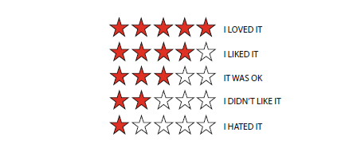

```{r global options, include=FALSE}
knitr::opts_chunk$set(error = TRUE, echo=FALSE, warning=FALSE, message=FALSE)
op = function(x, d=2) sprintf(paste0("%1.",d,"f"), x) 
```


```{r libraries, echo=FALSE}
# load all libraries 
# grab tinytex if not installed (knitr specific)
if(!tinytex:::is_tinytex()) tinytex::install_tinytex()
if(!require(scales)) install.packages("scales", repos = "http://cran.us.r-project.org")
if(!require(kableExtra)) install.packages("kableExtra", repos = "http://cran.us.r-project.org")
if(!require(tidyverse)) install.packages("tidyverse", repos = "http://cran.us.r-project.org")
if(!require(knitr)) install.packages("knitr", repos = "http://cran.us.r-project.org")
if(!require(lubridate)) install.packages("lubridate", repos = "http://cran.us.r-project.org")
if(!require(caret)) install.packages("caret", repos = "http://cran.us.r-project.org")
if(!require(recosystem)) install.packages("recosystem", repos = "http://cran.us.r-project.org")
if(!require(gridExtra)) install.packages("gridExtra", repos = "http://cran.us.r-project.org")
```

# INTRODUCTION AND PROJECT OVERVIEW

## DATA SOURCE
The data set is sourced from **GroupLens** project that was originally built as a research lab to recommend news by collecting ratings from news readers. The ratings were used to predict whether other readers would like an article before they read it. Then, it was extended to other products such as books and movies, referred to as *BooksLens* and *MovieLens* respectively. 
Among many other accomplishments, the GroupLens research team was renowned for releasing several data sets during the early years in the field of recommendation systems, when data sets were not easily available for benchmarking. Consequently, their publicly available [set with 10M ratings](https://grouplens.org/datasets/movielens/10m/) is utilized for this project. While there exists a larger 100M dataset, 10M is sufficient for the project at hand while allowing relative ease of computation on any machine with 16GB of RAM. 

## PROJECT OVERVIEW AND GOALS
We will attempt to construct a movie recommendation system using the MovieLens dataset as described. Using 90/10 partition, the data is split into training (edx) and validation sets. The final model Root Mean Squared Error (RMSE) from the true ratings from the validation set is returned. As the validation is "set aside" and can not be used for training the algorithm, it will only be used for evaluating the RMSE of the final model.

The RMSE is a measure of the differences between values predicted by a model and the values observed (i.e., model accuracy), and is calculated as follows:

$$ RMSE = \sqrt{\frac{1}{N}\displaystyle\sum_{u,i} (\hat{y}_{u,i}-y_{u,i})^{2}} $$

Similar to other R-squared like measures such as Mean Absolute (MAE) or Mean Bias (MBE) Errors, RMSE is a *negatively-oriented* metric, i.e., the lower values are better. However, due to squared errors, RMSE tends to give more weight to large errors relative to the others and therefore, is more sensitive to outliers. The RMSE is always larger or equal to MAE for a sample size n as in:
$$ MAE \leq RMSE \leq  \sqrt{n}  MAE $$
As RMSE is a common metric used in the the famous Netflix challenge, there is no need to consider other measures for purposes of this project. 

# METHODS AND ANALYSIS
## EXTRACT-TRANSFORM-LOAD & DATA CLEANING

The first 6 rows of the initial training data set, **edx**,  as extracted are displayed in Table 1.

```{r load_sets}
  if (!file.exists('edx.RDS') || !file.exists('validation.RDS')){
      source('MLens.modeling.R')
    }

  edx <- readRDS("edx.RDS") # reload the data sets
  validation <- readRDS('validation.RDS')
```

```{r head_edx}
  kable(head(edx), caption="Sample Data: First Look", booktabs=TRUE, linesep="")  %>%
  kable_styling(latex_options =c('striped', 'scale_down'))
```

It has `r number(dim(edx)[1], big.mark=",", digits = 0)` rows and `r dim(edx)[2]` columns as follows:
*`r colnames(edx)`*. It appears that *timestamp* is too precise of a feature and we won't be able to explore the full effects of seasonality on the ratings, i.e., whether some users are rating higher in spring/summer, for instance.

However, we can further improve the raw data by extracting the year of the rating from *timestamp* as well as the release year from *title* and potentially investigating the lag between the two. For example, would the new release skew the ratings away from the mean, more positively for "good" and negatively for "bad" movies? The year could be extracted from *title* with this [regular expression](https://regex101.com/r/Bllx8Z/2). Please contrast Table 2 to Table 1 for the transformed data appearance (new *released* and *year_rated* columns).

Also, we note that the original edx data set is in the form of a *long* data format with each row correspond to a single user/single movie which is not really suitable for our analysis and will be converted to a *wide* (rating matrix) format with users in rows and movies in columns.

```{r convert_timestamp}
 #  convert timestamp to the date &  extract movie release year as separate feature
fun_transform <- function(x){
  x %>% 
    mutate(year_rated=year(as_datetime(timestamp))) %>% 
    group_by(title) %>% 
    extract(title,into=c("title","released"), "^(.*?)\\((\\d{4})\\)") %>% 
    mutate(released=as.integer(released)) %>% 
    ungroup %>%   
    select(-c(timestamp))
  }

edx <- fun_transform(edx)
validation <- fun_transform(validation)
```

```{r second_look}
kable(head(edx), caption="Sample Data: extracted realease year and year rated", booktabs=TRUE, linesep="")  %>%
kable_styling(latex_options ='striped')
```
  
## DATA EXPLORATION & VISUALIZATION



As we are predicting ratings, it can be seen that ratings are **discrete** with half point intervals, ranging from 0.5 to 5 with 4 being the most common.  Also, the half star are given a lot less frequently than whole star ratings, as evident from  Figure 2 (red vs blue).


``` {r freq_plot, fig.cap = "Frequency Plot, Movie Ratings"}
    edx %>%
    mutate(whole_rating = rating == round(rating)) %>%
    ggplot(mapping=aes(x=rating, fill=whole_rating)) +
    geom_histogram(binwidth=0.25) +
    scale_y_continuous(labels=comma)
```

We can observe the frequency plots in Figure being highly skewed. They show that only a relatively small portion of users are active (high frequency ratings) and, likewise, a small portion of movies are popular. We note that  after about 6,000 most active users and 500 most popular movies the counts tail off. Because of the rarity of observed ratings in the long tail it is generally more difficult  to provide robust rating predictions for tail users or movies. In fact, many recommendation algorithms  have a tendency to suggest popular rather than infrequent movies.  This also has a negative impact on diversity as users may often become bored by receiving the same set of recommendations of popular movies.


``` {r long_tail_plot, fig.cap = "Long Tailed Plots: Active vs Tail Users and Popular vs. Unrecognized Movies"}
  a <- edx %>% 
    group_by(userId) %>% 
    summarize(number_ratings = n()) %>% 
    filter(number_ratings>10 & number_ratings < 500) %>% 
    arrange(desc(number_ratings)) %>% 
    ggplot(aes(y=number_ratings)) +
    geom_histogram(binwidth = 25, color='coral', fill='skyblue') +
    xlab('Number users') +
    ylab('Number ratings')

  b <- edx %>% 
    group_by(movieId) %>% 
    summarize(number_ratings = n()) %>% 
    filter(number_ratings>10 & number_ratings < 500) %>% 
    arrange(desc(number_ratings)) %>% 
    ggplot(aes(y=number_ratings)) +
    geom_histogram(binwidth = 20, color='coral', fill='sandybrown') +
    xlab('Number movies') +
    ylab('Number ratings')  

    library(gridExtra)
    grid.arrange(a, b, ncol=2)


```


```{r uniq}
n_ <- edx %>% summarize(n_users=n_distinct(userId), n_movies = n_distinct(movieId))
```
For the training set under consideration, there are 10,677 different movies and 69,878 users or raters with "Pulp Fiction" being the most rated movie and five most given ratings in decreasing order are 4, 3, 5, 3.5, and 2.  [Source: Quiz]

The data could be viewed as an $n \times m$ rating matrix with $n$ rows for rating users and $m$ columns for movies. While there are `r number(as.matrix(n_[1]), big.mark=",")` rows and `r number(as.matrix(n_[2]), big.mark=",")` columns which is a matrix of `r number(as.integer(n_[1] * n_[2]), big.mark=",")` entries or cells, only `r percent(as.matrix(dim(edx)[1] / (n_[1] * n_[2])))` of overall movies are rated. 
As there are almost 7 times less movies than users, movie based algorithm would probably be less computationally prohibitive to utilize from the computational power standpoint.

The fact that our rating matrix is 99% empty or *extremely* sparse in other words,  may lead to additional bias. This is important as essentially we are trying to perform a missing value estimation. Additionally, some well-known methods such as kNN neighborhood-based interpolation may not work as well on a very sparse dataset. 

In general per [@RecSys], the methods for such data as ours are called **collaborative filtering** methods. Collaborative filtering methods use the collaborative power of the ratings provided by multiple users to make recommendations.  Most users would have viewed only a small fraction of the large universe of available movies. As a result, most of the ratings are unspecified. The specified ratings are also referred to as **observed** ratings. With this data, we are dealing with a matrix with a lot of **unobserved** ratings. To illustrate, consider the below (transposed) matrix representing 10 most active users ratings for 10 most rated movies compared to a sample of random user ratings for a sample of random movies:


```{r heatmaps, fig.cap = "top 10 users rate 10 top movies vs.  random users rate random movies",   fig.show="hold", out.width="50%"}
  maxUser <- tail(names(sort(table(edx$userId))),10)  # top 10 users
  maxMovie <- tail(names(sort(table(edx$movieId))),10) # top 10 movies
  reduced <- edx[edx$userId %in% maxUser,]   # reduced 10 users df
  reduced <- reduced[reduced$movieId %in% maxMovie,]  # reduced more for 10 movies
  tenx10 <- reduced[, c("userId", "title", "rating"), drop=FALSE] %>% spread(title, rating)
  tenx10_long <- gather(tenx10 %>% mutate(userId = factor(userId)), title, rating, -userId)
  ggplot(tenx10_long, aes(userId, title, fill=rating))+ geom_tile() +
      theme(axis.text.x = element_text(angle = 90))

  randId <- sample(unique(edx$userId),100) # random < = 100 users
  randMovie <- sample(unique(edx$movieId),100) # random < = 100 movies
  rand <-edx %>% filter(userId %in% randId) %>% filter(movieId %in% randMovie)
  rand <- rand[, c("userId", "title", "rating"), drop=FALSE] %>% spread(title, rating)
  rand10long <- gather(rand %>% mutate(userId = factor(userId)), title, rating, -userId)
  ggplot(rand10long, aes(userId, title, fill=rating))+ geom_tile()+
      theme(axis.text.x = element_blank())
```


```{r print_table_tenx10, eval=FALSE}
 kable(tenx10, format='latex', escape=F, caption='Most active users rating most rated movies', booktabs=TRUE, linesep="")  %>%
  kable_styling(latex_options ='striped') %>% 
  row_spec(0, font_size = 8.5, angle = 90)
 
```

Even for the top ten, there are movies that were not rated! For instance, *The Fugitive* was not rated by users *'27584'* and *'58357'*, per Figure 4.  The *observed* ratings represent explicit interval ratings from .5 to 5.  

Important characteristics of ratings, such as sparsity and the long tail, need to be taken into account during the recommendation process. The main challenge in designing collaborative filtering methods is that the underlying ratings matrices are sparse. By adjusting the recommendation algorithms to take such  properties into account, it is possible to obtain more meaningful predictions. 


``` {r avg_ratings_plot, fig.cap = "Average ratings by frequency"}
df1 <- edx %>% 
  filter(released >= 1993) %>%
  group_by(movieId) %>%
  summarize(n = n(), years = 2018 - first(released),
            title = title[1],
            rating = mean(rating)) %>%
  mutate(rate = n/years) %>%
  arrange(desc(rate)) 

df1 %>% ggplot(aes(rating, rate)) + geom_point() +  geom_smooth(method='auto', formula = y ~ poly(x))
rm(df1)
```

The plot in Figure 5 explores the premise that the top movies have above average ratings. We stratify the post-1993 movies by ratings per year and compute their average ratings. To calculate number of ratings per year, the year 2018 was used as the end year.  When the rate (average rating) plotted versus ratings per year (rate in Figure 5) with an estimated trend, the trend does support the above premise. 

The data also has a *genres* feature. It includes every genre that applies to the movie as some movies fall under several genres. Let's define a category as any combination than could appear but only categories with more than 1,000 ratings. Then we will  compute the average and standard error for each category. 
The averages by genre plotted as error bar plots show that genre does have a significant effect, per Figure 6. 

``` {r genre, fig.cap ="Average ratings by genre"}
df1 <- edx %>% 
  group_by(genres) %>%
  summarize(cnt = n(),
            avg = mean(rating),
            se= sd(rating)/sqrt(cnt)) %>%
  filter(cnt>1000) %>% 
  mutate(genres = reorder(genres, avg))


df1%>%
  ggplot(aes(x = genres, color = 'coral', y = avg, ymin = avg - 2*se, ymax = avg + 2*se)) + 
  geom_point() +
  geom_errorbar() + 
  theme(text = element_text(size=8),
        axis.text.x = element_text(angle = 90, hjust = 1))
```

## ANALYSIS: BASELINE MODEL

*"The secret to getting ahead is getting started."
--Mark Twain*

As we need to start somewhere anyway, let's just use mean as the predictor for our first model. However, before any modeling, the *edx* set has to be split into train and test sub sets using the same 10% partition as discussed before. The *edx_test* set will be used to asses RMSE for our trained model to select the best final model with lowest RMSE. That model's RSME will be cross checked on the validation set at the project end. The Root Mean Squared Error > 1 indicates an error greater than 1 star, i.e., model's predicted rating of more than 1 star off the actual is not an acceptable prediction.  In this project, we'll target an RMSE < 0.8649 as acceptable.   


```{r split_edx}
set.seed(1, sample.kind="Rounding")
  # 1.1  test set will be 10% of edx data
test_index <- createDataPartition(y = edx$rating, times = 1, p = 0.1, list = FALSE)
  edx_train <- edx[-test_index,]
  temp <- edx[test_index,]
  # 1.2 Make sure userId and movieId in edx_test set are also in edx_train
  edx_test <- temp %>% 
    semi_join(edx_train, by = "movieId") %>%
    semi_join(edx_train, by = "userId")
  # 1.3 Add 17 obs. removed from edx_test back into edx_train set
  removed <- anti_join(temp, edx_test)
  edx_train <- rbind(edx_train, removed)
  # 1.4 cleanup the temp variables
  rm(test_index, temp, removed) 

```

The base model predicts the same rating for all movies by all users (i.e., calculating mean rating for entire dataset): 

$$ Y_{u, i} = \mu + \epsilon_{u, i} $$

The $\epsilon_{u,i}$ is an independent error sample from the same distribution centered at 0 and $\mu$ the “true” rating for all movies. 
```{r RSME}
  RMSE <- function(true_ratings, predicted_ratings){
  sqrt(mean((true_ratings - predicted_ratings)^2))}
```

```{r baseline}
target <- 0.8649
mu <- mean(edx_train$rating)
results <- tibble(model = "Mean",
                       RMSE = RMSE(edx_test$rating, mu),
                       "Improvement vs Target" = target - RMSE)

kable(results, "pandoc", align='c', caption="RMSE: baseline model")
```

RMSE result for our *starter* model is `r op(results$RMSE, 4)` which is greater than 1 and is obviously unacceptable indicating an error of greater than 1 star, but we got a baseline at the very least!


## ANALYSIS: BASELINE VARIATIONS - MOVIE EFFECTS

*"When you're in something as successful as 'Transformers,' you can't use it as a sales piece for your ability as an actress because it's all about the special effects."  --Megan Fox*

Collaborative Filtering methods try to capture the interactions between users and movies that produce
the different rating values. However, much of the observed rating values are due to effects associated with either users or movies, independently of their interaction. Our data exhibit large user and movie biases or effects; i.e., systematic tendencies for some users to give higher ratings than others, and for some movies to receive higher ratings than others. We will encapsulate those effects, which do not involve user-item interaction, within the baseline predictors (also known as biases).
Assuming that  more popular movies get rated higher, movie bias is calculated as follows:

$$Y_{u, i} = \mu +b_{i}+ \epsilon_{u, i}$$
where $b_{i}$ is a movie effects. 
    
```{r movie_effects, fig.cap= "Movie bias: movie individual ratings normalized by overall avg"}    
    movie_avgs <- edx_train %>% 
      group_by(movieId) %>% 
      summarize(b_i = mean(rating - mu))
    # 2.3a visual of movie effects distribution
      qplot(b_i, data = movie_avgs, bins = 30,
            ylab = "movieId", fill = I('salmon'))
    
```

By adding the computed $b_{i}$ to $\mu$, the predictive model includes movie rating bias or the difference between individual movie average and the total movie average. It will predict higher rating for a movie which has generally rated higher than average of all movies, and lower rating for a movie that rated lower than overall average. The resulting RMSE is much better than baseline's, but still is fairly high.

```{r movie_effects_out}   
  # 2.3b predict with mean + movie effects, b_i on a test set
    predicted_ratings <- mu + edx_test %>% 
      left_join(movie_avgs, by='movieId') %>%
      pull(b_i)

  results <- add_row(results, model = "Mean + Movie effects",
                  RMSE = RMSE( edx_test$rating, predicted_ratings),
                  "Improvement vs Target" = target - RMSE)
  kable(results, "pandoc", align='c',  caption="RMSE Results")
  #kable(results, caption="RMSE Results: 2 methods", booktabs=TRUE, linesep="")  %>%
  #kable_styling(latex_options =c('striped'))
  
```  


## ANALYSIS: BASELINE VARIATIONS - COMBINE MOVIE AND USER EFFECTS

*“No good movie is too long and no bad movie is short enough.” --Roger Ebert*

Similarly to movie bias, there exist user bias as some users are rating movies higher than others and vice versa. We could add user bias as another variable to our predictive model as follows:
$$Y_{u, i} = \mu + b_{i} + b_{u} + \epsilon_{u, i}$$
where $b_{u}$ variable is for user-specific effects. The resulting RMSE is in line with  the target!

```{r user_movie_effects}
  # (approximation of LM model lm(rating ~ 
  #  as.factor(movieId) + as.factor(userId)) due to R objects written to memory)
    user_avgs <- edx_train %>% 
      left_join(movie_avgs, by='movieId') %>%
      group_by(userId) %>% 
      summarise(b_u=mean(rating - mu - b_i)) 

    # predict with mean + movie + user effects, b_i and b_u on a test set 
      predicted_ratings <- edx_test %>% 
        left_join(movie_avgs, by='movieId') %>%
        left_join(user_avgs, by='userId') %>%
        mutate(pred = mu + b_i + b_u) %>%
        pull(pred)

      results <- add_row(results, model = "Mean + Movie and User effects",
                         RMSE = RMSE( edx_test$rating, predicted_ratings),
                         "Improvement vs Target" = target - RMSE)
      kable(results, "pandoc", align='c',  caption="RMSE Results")
```


## ANALYSIS: REGULIRIZED MOVIE AND USER EFFECTS MODEL

*"The stiffer the penalty, the greater the message is sent."
-- Lou Brock*

While the last model's RMSE of `r op(last(results[3,2]), 4)` is fairly decent, there is also a potential hidden issue with the above models, as supposedly "best" and "worst" movies could be rated by a handful of users, introducing noise to the model. The noisy estimates are not to be trusted as they can lead to incorrect predictions (model overfitting), larger prediction errors and higher RMSE as a result. 

*Regularization* is a technique that penalizes large estimates that are based on small sample sizes. It essentially introduces a penalty coefficient that smothers the total variability of the effects tested above. 

$$b_i = \frac{1}{\lambda+n_i} \sum_{u = 1}^{n_i} (Y_u,_i-\hat{\mu})$$


```{r regularized_RMSE}
 # 4.1 RMSE function using penalty coeff
    RMSE_reg <- function(l, train, test){
      # lambdas, train and test sets are function arguments
      mu <- mean(train$rating) #mean
      
      b_i <- train %>% 
        group_by(movieId) %>%
        summarize(b_i = sum(rating - mu)/(n()+l))
      
      b_u <- train %>% 
        left_join(b_i, by="movieId") %>%
        group_by(userId) %>%
        summarize(b_u = sum(rating - b_i - mu)/(n()+l))
      
      predicted_ratings <- 
        test %>% 
        left_join(b_i, by = "movieId") %>%
        left_join(b_u, by = "userId") %>%
        mutate(pred = mu + b_i + b_u) %>%
        pull(pred)
      
      return(sqrt(mean((test$rating - predicted_ratings)^2)))
    }
```


```{r lambdas}
    # cross validate lambda that minimize RSME
    lambdas <- seq(0, 10, .5)  
    RMSEs <- sapply(lambdas,FUN=RMSE_reg, train=edx_train, test=edx_test)
    qplot(lambdas, RMSEs, color=factor(round(RMSEs,7)), main="RMSE for whole lambdas")
    initial_l <- lambdas[which.min(RMSEs)]  
    # refine on smaller range with more intervals
    lambdas <- seq(initial_l -.5, initial_l+.5, .05)
    RMSEs <- sapply(lambdas,FUN=RMSE_reg, train=edx_train, test=edx_test)
    qplot(lambdas, RMSEs, color=factor(round(RMSEs,7)), main="RMSE for 5 bp lambdas")
    final_l <- lambdas[which.min(RMSEs)]  
    
    results <- add_row(results, model = "Mean + Regularized Movie and User effects",
                       RMSE = min(RMSEs),
                       "Improvement vs Target" = target - RMSE)
    kable(results, "pandoc", align='c',  caption="RMSE Results")
```

## ANALYSIS: MATRIX FACTORIZATION
*"What is the Matrix?" -- Neo*

According to [@Yehuda],  there are two main techniques of collaborative filtering: *the neighborhood approach* and *latent factor* models. Neighborhood methods focus on relationships between movies or, alternatively, between users. On the other hand, matrix factorization models map both users and movies to a joint latent factor space of dimensionality $f$ , such that user-movie interactions are modeled as inner products in that space. The latent space tries to explain ratings by characterizing both movies and users on factors automatically inferred from user feedback. For example, such factors might measure obvious dimensions such as comedy vs. drama, amount of action, or orientation to children; less well defined dimensions such as depth of character development or “quirkiness”; or completely uninterpretable dimensions.

Accordingly, each movie $i$ is associated with a vector $q_i ∈ R^f$ , and each user $u$ is
associated with a vector $p_u ∈ R^f$. For a given movie $i$, the elements of $q_i$ measure the extent to which the movie possesses those factors, positive or negative. For a given user $u$, the elements of $p_u$ measure the extent of interest the user has in movies that are high on the corresponding factors (again, these may be positive or negative). The resulting dot product, $q^{T}_{i}p_u = \sum\limits_{k=1}^{f}{q_kp_k}$, captures the interaction between user $u$ and movie
$i$; i.e., the overall interest of the user in characteristics of the movie. The final rating is created by also adding in the aforementioned baseline predictors that depend only on the user or movie. Thus, a rating is predicted by the rule:

$$Y_{u, i} = \mu + b_{i} + b_{u} + q^{T}_{i}p_u + \epsilon_{u, i}$$
In order to learn the model parameters ($b_u$,$b_i$, $p_u$ and $q_i$) we minimize the regularized squared error using stochastic gradient descent method via *recosystem* R library, see [@recosystem] for reference. The resulting RMSE shows a significant improvement over target, and we can proceed to the final model validation.
```{r MF, results='hide'}
    set.seed(1, sample.kind = "Rounding")
    
    # 3.1 Create a model object (a Reference Class object in R) by calling Reco()
    r <- Reco() 
    # 3.2 create train/test sets in recosystem (sparse matrix triplet: user, movie, rating) format
    # data_memory(): Specifies a data set from R objects
    train_set <-  with(edx_train, data_memory(user_index = userId, 
                                               item_index = movieId, 
                                               rating     = rating))
    test_set  <-  with(edx_test,  data_memory(user_index = userId, 
                                               item_index = movieId, 
                                               rating     = rating))
    
    # 3.3 Tune the model parameters
    # computationally expensive; therefore, pre-run and saved to git as 'opts.RDS'
    if (file.exists('opts.RDS')){
        opts <- readRDS('opts.RDS')}else{
        opts <- r$tune(train_set, opts = list(dim = c(70), 
                                           lrate = c(0.1, 0.2),
                                           costp_l2 = c(0.01, 0.1), 
                                           costq_l2 = c(0.01, 0.1),
                                           nthread  = 4, niter = 20, verbose=TRUE))
        }
    # 3.4 train the model
       r$train(train_set, opts = c(opts$min, nthread = 4, niter = 20))
    
    # 3.5 estimate predicted values, with out_memory(): result should be returned as R objects
    y_from_reco <- r$predict(test_set, out_memory())
```
``` {r MF_results}
    # 3.6 calc RMSE and add to results
    results <- add_row(results, model="Matrix Factorization",
                       RMSE = RMSE(edx_test$rating, y_from_reco),
                       "Improvement vs Target" = target - RMSE)
     kable(results, "pandoc", align='c',  caption="RMSE Results")

```


## ANALYSIS: FINAL MODEL VALIDATION
*"All models are wrong but some are useful."
-- George E. P. Box*

We can finally train the complete *edx* set  on matrix factorization model and estimate the RMSE on the previously unused *validation* set.  If the final RMSE stays reasonably close and below the target, we have found a good enough model. 

``` {r final, results='hide'}
edx_set <-  with(edx, data_memory(user_index = userId, 
                                              item_index = movieId, 
                                              rating     = rating))
    validation_set  <-  with(validation,  data_memory(user_index = userId, 
                                              item_index = movieId, 
                                              rating     = rating))
    
    # 4.2 assuming the same tuning parameters as before, train the model
    r$train(edx_set, opts = c(opts$min, nthread = 4, niter = 10))
    
    y_from_reco_final <- r$predict(validation_set, out_memory())
```
```{r final_results}
    results <- add_row(results, model="Matrix Factorization - Final Validation",
                       RMSE = RMSE(validation$rating, y_from_reco_final),
                       "Improvement vs Target" = target - RMSE)
    kable(results, "pandoc", align='c',  caption="Final RMSE Results")

```    

# CONCLUSION
We have successfully constructed the movie recommendation system using Matrix Factorization with Gradient Descent method by employing *recosystem* **R** library. The achieved RMSE of `r results[[nrow(results),2]]` is `r percent(results[[nrow(results),ncol(results)]]/target)` better than a target of `r target`. 

While the dimentionality reducing Matrix Factorization method we used is a a stand along method, it could be potentially combined with neighborhood-based methods.  Neighborhood-based methods on their own might not be very robust given the data sparsity and long-tails. Another limitation of neighborhood-based methods is that they are computationally expensive as the neighborhood is used in order to extrapolate the unknown ratings of a record. In order to speed up neighborhood based method, clustering is often used. 

As neighborhood-based methods can be viewed as linear models, the potential improvement to the model could be introducing the features that were left out of the analysis such as *year_released*, *year_rated*, and *genre*. 


# REFERENCES

